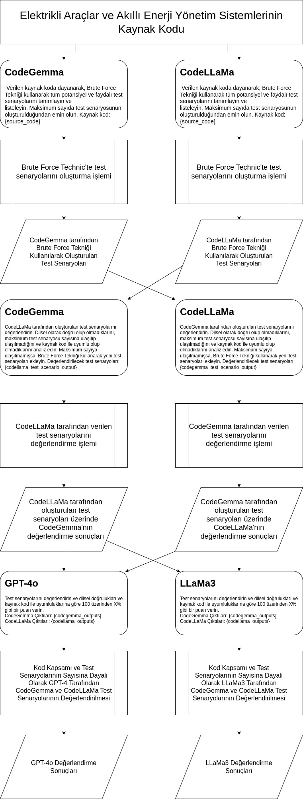

# TOK 2024 - Electrical Vehicles and Intelligent Energy Management Systems

Bu proje, elektrikli araçlar ve akıllı enerji yönetim sistemleri için test senaryoları oluşturmak ve değerlendirmek amacıyla iki farklı modelin kullanılmasını içermektedir: CodeGemma ve CodeLLaMa. Projede kullanılan yöntemler ve süreçler aşağıdaki görselde detaylandırılmıştır.



## Proje Yapısı

1. **CodeGemma**:
   - Verilen kaynak kodu temel alarak tüm potansiyel ve yararlı test senaryolarını Brute Force Tekniği ile belirler ve listeler.
   - Brute Force Tekniği kullanılarak oluşturulan test senaryolarını üretir.
   - Test senaryolarının maksimum sayıya ulaşıp ulaşmadığını ve bu test senaryolarının kod kapsamasının %100'e yakın olup olmadığını değerlendirir.
   - Gerekirse gerekli test senaryolarını oluşturur.

2. **CodeLLaMa**:
   - Verilen kaynak kodu temel alarak tüm potansiyel ve yararlı test senaryolarını Brute Force Tekniği ile belirler ve listeler.
   - Brute Force Tekniği kullanılarak oluşturulan test senaryolarını üretir.
   - Test senaryolarının maksimum sayıya ulaşıp ulaşmadığını ve bu test senaryolarının kod kapsamasının %100'e yakın olup olmadığını değerlendirir.
   - Gerekirse gerekli test senaryolarını oluşturur.

3. **Değerlendirme Süreci - GPT-4o ve LLaMa3**:
   - CodeGemma ve CodeLLaMa tarafından oluşturulan test senaryoları karşılıklı olarak değerlendirilir.
   - GPT-4o ve LLaMa3 modelleri, test senaryolarını test kapsamı ve test senaryolarının sayısı bazında değerlendirir ve 100 üzerinden bir puan verir.

## Dosya Yapısı

- `tok_llm.py`: Projenin ana kod dosyası.
- `array_to_solution.py`: Proje için testlerin gerçekleştirildiği dosya.
- `images/tok2024_structure.jpg`: Projenin yapısını gösteren görsel.

## Kurulum ve Çalıştırma

1. Projeyi klonlayın:
   ```sh
   git clone https://github.com/ESOGU-SRLAB/EV-Software-Test-Scenarios-LLM.git
   cd tok2024
2. Gereklilikleri yükleyin:
   ```sh
   pip install -r requirements.txt
3. Projeyi çalıştırın:
   ```sh
   python tok_llm.py
   ```

   
